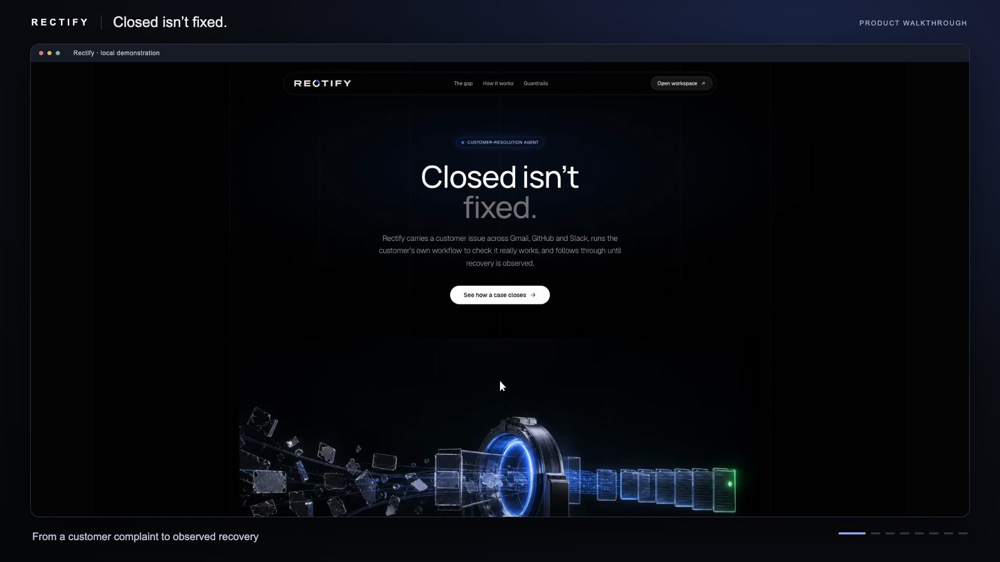
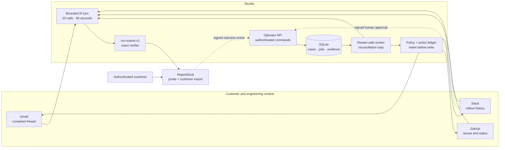

<div align="center">

# Rectify

### Closed isn’t fixed. The customer’s workflow is the finish line.

**Most agent systems verify that an action landed. Rectify verifies that the customer can work again.**

Rectify is a recovery agent for B2B support teams. It connects a complaint in Gmail to engineering context in GitHub and Slack, verifies the customer’s actual workflow, gates communication behind human approval, and closes the loop only after the product observes the customer succeed.

   

**[Open the live app ↗](https://rectify-app-two.vercel.app)** · **[Watch the narrated demo ↗](https://enoch208.github.io/rectify-/demo/v2/)** · **[Download the MP4 ↗](https://enoch208.github.io/rectify-/demo/v2/rectify-demo.mp4)** · **[Read the system and reliability brief](docs/SYSTEM_AND_RELIABILITY.md)**

</div>

[](https://enoch208.github.io/rectify-/demo/v2/)

The demo follows Northstar Research. Its monthly CSV endpoint returns HTTP 200, its engineering issue is closed, and Slack says the rollout is complete—but the CSV has no records. Rectify detects the contradiction, creates a customer-impact issue, hands it to engineering, waits for a human-applied configuration fix, rechecks the same export, obtains approval for the exact email, sends it once, and observes the customer’s successful export before declaring recovery.

The recording uses the actual application and a real investigation model. Gmail, GitHub, Slack, and ReportDesk are explicitly labelled `LOCAL FIXTURE`; they are not presented as live-provider results. Captions, transcript, source, and measured video checks are available from the [demo page](https://enoch208.github.io/rectify-/demo/v2/).

## Live deployment

| Surface | Link | Notes |
|---|---|---|
| Rectify site and operator workspace | [rectify-app-two.vercel.app](https://rectify-app-two.vercel.app) | Served by Vercel; every `/api` request is forwarded to the backend host. The workspace requires an operator token. |
| Backend API | [rectify-api.truematchx.com](https://rectify-api.truematchx.com) | Case API, SQLite store, worker and ReportDesk in one container behind an HTTPS tunnel, with no ports exposed publicly. Runs the real investigation model; Gmail, GitHub, Slack and ReportDesk are labelled `LOCAL FIXTURE`. |
| ReportDesk demo product | [Operator fix page](https://rectify-desk.truematchx.com/operator) · customer export page linked from each approved email | Demo-only pages protected by their own tokens. |

The deployed Northstar case was run end to end on the backend host: investigation with `gpt-5.4-mini-2026-03-17` (9 tool calls), failed export check and engineering handoff, human configuration fix, passing recheck, Slack-signed approval, a single send, the customer's own export, and `RECOVERED` with synchronization `COMPLETE`.

**Explore:** [Idea](#the-idea) · [Architecture](#architecture) · [External apps](#external-apps) · [Reliability](#reliability-is-part-of-the-workflow) · [Evidence](#inspect-the-evidence) · [Run locally](#run-locally) · [Evaluation](#verify-and-evaluate)

## Two-minute walkthrough

| Time | What the recording demonstrates |
|---|---|
| 0:00–0:20 | The gap between an internally closed ticket and a customer who can actually work |
| 0:20–0:47 | Trusted Gmail intake and a real model correlating GitHub, Slack, and the customer’s export |
| 0:47–1:17 | HTTP 200 with missing records, safe engineering handoff, human fix, and deterministic recheck |
| 1:17–1:48 | Exact-message approval, a single fixture send, and the customer retrying the workflow |
| 1:48–2:00 | Signed recovery evidence and confirmed GitHub/Slack synchronization |

## The idea

Support systems usually measure internal activity: a ticket closed, a deploy announced, an email sent. Rectify measures the external outcome: **can this customer complete the task now?**

<div align="center">

**`COMPLAINT → INVESTIGATE → VERIFY → HAND OFF → RECHECK → APPROVE → SEND → OBSERVE RECOVERY`**

</div>

- The model investigates untrusted context through narrow, read-only tools. It cannot send messages, choose recipients, approve itself, or mark a customer recovered.
- Deterministic server policy owns every state transition and external write. A passing probe alone is insufficient, and a closed GitHub issue is never treated as proof.
- A signed customer outcome event—not an agent claim or email delivery—establishes recovery. GitHub and Slack must then confirm the follow-through.

## Architecture



The probe and customer session call the **same export implementation**. Northstar’s broken path is therefore HTTP-successful but semantically wrong: the verifier compares the parsed CSV with a versioned tenant manifest and records `FAIL`, `PASS`, or `INCONCLUSIVE` rather than trusting the status code.

## External apps

| App | Reads | Writes | Safety boundary |
|---|---|---|---|
| Gmail | The allowlisted support thread | Stored draft and the approved customer email | Trusted intake fixes tenant and recipient; send rechecks the stored MIME and approval hash |
| GitHub | Candidate issues, labels, comments | Customer-impact issue and recovery comment | Tenant-scoped repository; every effect carries a unique action marker |
| Slack | Rollout messages and threads | Engineering handoff, approval request, recovery update | Raw-body signature, timestamp window, constant-time compare, approver allowlist, nonce and expiry |

Each adapter has an explicit `live`, `arga`, or `local_fixture` mode. Missing credentials fail loudly; there is no silent fixture fallback. `pnpm smoke:providers` performs one real read and one real write per configured live provider and prints the result.

## Reliability is part of the workflow

| Failure mode | Enforced behavior | Evidence |
|---|---|---|
| Provider accepts a write but the response is lost | Persist immutable intent as `DISPATCHING`; reconcile the marker after restart; never blindly resend | Worker restart and lost-send tests |
| Draft, recipient, product revision, or verification changes after approval | Reject the send and return the case to a human | Send-policy and edited-draft tests |
| Approval is forged, stale, duplicated, or from the wrong Slack identity | Reject before enqueueing a send | Signature/binding and E06 tests |
| Export times out | Record `INCONCLUSIVE`; never convert uncertainty into success | Verifier timeout test |
| Retrieved content attempts prompt injection | Model tools remain read-only; tenant, recipient, approval, and state stay server-controlled | E04 scenario |
| Identity maps to multiple tenants | Stop for operator clarification and persist the choice | E03 scenario |
| “Fixed” issue still produces an empty export | Keep the failed evidence, hand off, and send nothing until a human fix and passing recheck | E02 scenario |

The test suite currently passes **92 behavior-focused tests across eight workspaces**. E01–E06 drive the real store, worker, ReportDesk, approval binding, and fixture provider state. Their independent checker grades captured provider effects rather than trusting the agent or ledger.

| Scenario | What must be demonstrated |
|---|---|
| E01 | A valid fix survives distractor records and reaches observed recovery |
| E02 | A closed issue with a broken export sends nothing before the human fix |
| E03 | Ambiguous customer identity waits for an operator choice |
| E04 | Retrieved prompt injection cannot alter scope, recipient, approval, or recovery |
| E05 | Lost responses reconcile once after restart; unresolved outcomes remain held |
| E06 | Edited, stale, and duplicate approvals are rejected; exactly one authorized send occurs |

## Inspect the evidence

| Artifact | What it proves |
|---|---|
| [Recorded workflow evidence](docs/demo/v2/workflow-evidence.json) | Real-model run: 10 tool calls in 21.691 s; failed then passing export; seven confirmed actions; `RECOVERED` and sync `COMPLETE` |
| [Independent evaluation manifest](evals/final-run-manifest.redacted.json) | The final 18-trial real-model benchmark is honestly marked `NOT_RUN`, including the missing prerequisites |
| [System and reliability brief](docs/SYSTEM_AND_RELIABILITY.md) | Trust boundaries, state ownership, approval binding, reconciliation, recovery rules, and evaluation method |
| [Video verification](docs/demo/v2/verification.json) | 120 s, 1920×1080, 30 fps, full decode and blank-frame checks passing |
| [Editable demo source](video/README.md) | Capture, narration, captions, render, and reproduction details |

## What is real, fixture-backed, and not run

| Capability | Status |
|---|---|
| Case store, durable job queue, action ledger, approvals, clarifications, API and operator workspace | Implemented and locally tested |
| Full Northstar recovery loop | Recorded with a real model, real SQLite and ReportDesk, fixture Gmail/GitHub/Slack |
| Gmail, GitHub, and Slack remote adapters plus reconciliation | Implemented and contract-tested; live credentials were not exercised in the recording |
| E01–E06 harness and independent checker | Implemented; harness tests pass with scripted models, which is not a benchmark result |
| Docker image and three-process restart persistence | Built and runtime-smoked locally |
| Openable Lemma trace | Not verified; the recorded run’s trace ID is null |
| Final E01–E06 × 3 real-model evaluation, live-provider smoke, Arga twins | `NOT RUN` |

## Run locally

Requirements: Node 24+, pnpm 10.33.0, and a persistent filesystem shared by the web process and worker for SQLite.

```sh
pnpm install --frozen-lockfile
cp .env.example .env
pnpm dev:local
```

Set each provider mode explicitly. For a credential-free local walkthrough use `GMAIL_MODE=local_fixture`, `GITHUB_MODE=local_fixture`, and `SLACK_MODE=local_fixture`, then provide the non-provider secrets listed in [.env.example](.env.example). Open `/sign-in`, enter `RECTIFY_OPERATOR_TOKEN`, and create a case from `thread-northstar-export`.

1. Press **Investigate**. With no model key, Rectify stops for a human and explains why; it never substitutes a scripted answer.
2. In ReportDesk `/operator`, enable the corrected export path, then press **Recheck workflow** in Rectify.
3. Approve the exact message. Live Slack uses **Approve and send**; fixtures use `pnpm approve:local <caseId>` through the same signed callback boundary.
4. Follow the customer link, authenticate, and export. The signed outcome moves the case to `RECOVERED`; confirmed GitHub and Slack updates complete synchronization.

## Verify and evaluate

```sh
pnpm lint
pnpm typecheck
pnpm test
pnpm build
pnpm format:check
```

The real-model runner requires three trials per scenario and refuses to write a successful manifest without independent verdicts:

```sh
RECTIFY_EVAL_ARTIFACT_DIR=./eval-artifacts RECTIFY_EVAL_OUTCOME_SECRET=<secret> pnpm eval:run
RECTIFY_EVAL_ARTIFACT_DIR=./eval-artifacts RECTIFY_EVAL_RESULTS_DIR=./eval-results RECTIFY_EVAL_OUTCOME_SECRET=<secret> pnpm eval
```

## Project map

| Path | Responsibility |
|---|---|
| `packages/core` | Browser-safe records and API schemas; outcome signing, send policy, and ledger through server-only subpaths |
| `packages/store` | SQLite cases, evidence, runs, jobs, approvals, trusted intake, and Slack binding |
| `packages/providers` | Typed Gmail, GitHub, and Slack adapters, MIME handling, markers, and reconcilers |
| `packages/agent` | Vercel AI SDK bounded turn with narrow tools and Lemma instrumentation |
| `packages/verifier` | Exact `csv-export-v1` manifest comparison |
| `apps/web` / `apps/worker` | Operator UI and API / persistent execution and reconciliation |
| `apps/reportdesk` | Demo product sharing one export path between probe and customer session |
| `evals` | Six scenarios, captured external effects, and independent checker |

## Engineering choices worth inspecting

- **Recovery is a product event, not a model judgment.** Only a fresh, tenant-bound, signed customer action matching the passing configuration revision can recover a case.
- **Exactly-once is not claimed.** SQLite cannot atomically commit with Gmail, GitHub, or Slack, so Rectify implements intent-first writes, unique logical keys, explicit `OUTCOME_UNKNOWN`, and provider-specific reconciliation.
- **Approval binds facts, not a button click.** The recipient, message bytes, draft, provider account, product revision, verification, Slack location, approver, nonce, and expiry are all checked again at dispatch.
- **The model is useful but not authoritative.** It resolves messy cross-app evidence; deterministic code controls identities, mutations, state transitions, limits, and recovery.

## Known limitations

Rectify currently supports one verification contract, one organization, one mailbox, one repository, and one Slack channel. ReportDesk tenant configuration is in memory and resets with the demo service. Reconciliation searches bounded provider windows. The evaluator resets fixture providers only. Deployment assumes one host with persistent SQLite shared by the web app and worker. The project does not claim arbitrary-product verification, exactly-once cross-provider delivery, universal prompt-injection resistance, or measured revenue and churn impact.
